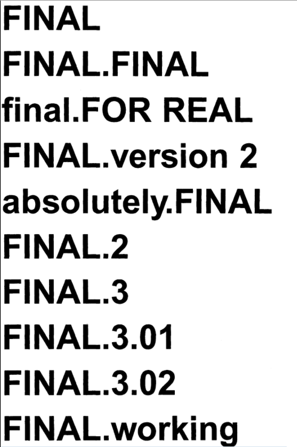
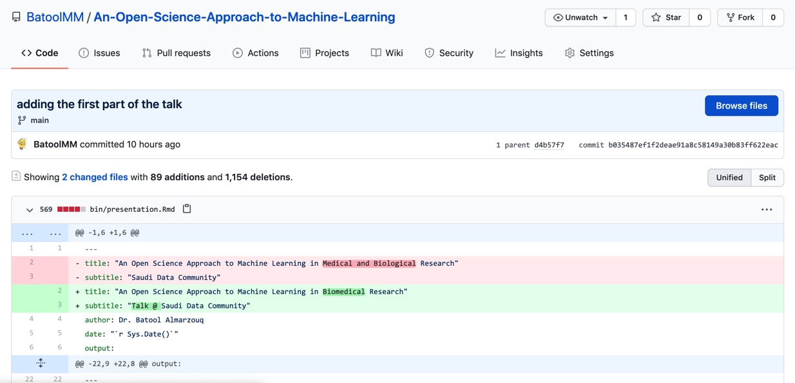
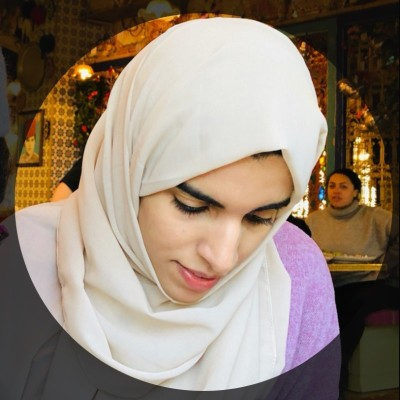

```{r setup, include=FALSE}
options(htmltools.dir.version = FALSE, servr.interval = 0.05)
knitr::opts_chunk$set(collapse = TRUE, fig.retina = 3)
library(xaringanExtra)
library(xaringan)
```

```{r share-again, echo=FALSE}
xaringanExtra::use_share_again()
```

class: title-slide, center, top
background-image: url(figs/landing2.png)
background-size: contain
background-position: bottom
background-size: 90%


#### `r rmarkdown::metadata$title`

#### `r rmarkdown::metadata$author`

---

class: left, inverse

# A little bit about me!

- A computational biologist affiliated to the University of Liverpool.
- Founder of RLadies Chapter in Saudi Arabia (Dammam).
- Member in the R Weekly team.
- Member in MiR accessibility committe.
- Member of several communities which advocate to Open Science including the turing way.
- Working on establishing an Open Science community in Saudi Arabia.

# Aknowledgment

- Allison ..
- ...


---

class: inverse, center, middle

# Why do we use ML in Biomedical Reserach?

---

background-image: url(figs/dna-to-protein2.jpg)
background-size: contain
background-position: 50% 1%
background-size: 80%
background-color: #ffffff

--

class: bottom
.pull-left[
### DNA
- DNA sequence alignment 
- DNA sequence classification
- DNA sequence clustering
- DNA pattern mining

Algorithms includes fuzzy sets, neural networks, genetic algorithms.]

--

.pull-right[

### RNA
- Mainly RNA-sequencing (RNA-seq)
- Differentially expressed genes (DEGs)
- Alternative splicing
- Mmall RNA expression

Algorithms includes Logistic Regression, Random Forest, LMT, Random Subspace.]

---

class: inverse, center, middle

# Solving the sequence is not enough!
We need to know the structure and function of the protein!

---

class: center, middle

background-image: url(figs/Sequence-to-function-relationship-A-Structure-function.png)
background-size: contain
background-position: 50% 25%
background-size: 80%
background-color: #ffffff

--

class: center, bottom
.bottom[
### How can we predict function from structure?
In order to predict the function from the structure, scientists uses different approaches including machine learning (ML) and deep learning algorithms.]

---

class: center

background-image: url(figs/SARS-CoV-2-illo-scaled.jpeg)
background-size: contain
background-position: 50% 40%
background-size: 70%
background-color: #ffffff

--

class: left, bottom

.pull-bottom[
Prediction of protein structure is important to develop small molecules and targeted therapy for diseases. ]
---

class: inverse, center, middle
## Why not only rely on Experemtal Methods?

---

class: center, middle

background-image: url(figs/growthOfDatabases.png)
background-size: contain
background-position: 50% 10%
background-size: 55%
background-color: #ffffff

--

class: left, bottom

.bottom[ 
Because of the growing gap between the newly-sequenced  and characterized sequences in the genome databases, computational methods in gene functional annotation are indispensable. Moreover, given the drop in the cost of the genome sequencing techniques, this gap is only destined to grow.]

---

class: inverse, center, middle

## Biology has become a highly data intensive science, dependent on complex, computational, and statistical methods!

---

class: inverse, center, middle

## So, how can we make these methods available and accessible for researchers, while ensuring that scientific results remain reproducible?

---

class: inverse, center, middle

## What is the percentage of reproducible research?

---

class: center, middle

background-image: url(figs/reproducibility-circle2.png)
background-size: 90%
background-color: #f3f3f3

---

class: inverse, center, middle

# How can we overcome the reproduciblity crisis?

--

### OPEN ACCESS

--

### OPEN DATA/FAIR DATA

--

### OPEN SOURCE SOFTWARE

--

### SHARE CODE/ANALYSIS

--

### Share ENVIRONMENT

--

### VERSION CONTROL

--

### TESTING

--

### DOCUMENTATION

---

class: inverse, center, middle

# What is the FAIR principles?

---

class: center, bottom
background-image: url(figs/Fair-principles.jpg)
background-size: contain
background-size: 70%
background-color: #ffffff

class: left, bottom
.footnote[.red.bold[*] The Turing Way project illustration by Scriberia. Zenodo. http://doi.org/10.5281/zenodo.3332807]

---

class: inverse, center, middle

# Why use version control (git)?

---

# Version Control in the Old Days ..

.pull-left[
]
.pull-right[

]

---

# Real Version Control (including backup)



---

class: center, middle, inverse

## In the panademic, some publishers have “opened” their journals to make certain articles freely available.

--

## Databases have been created that are completely open access, such as the Open COVID Pledge.

--

## Other journals or platforms that were already open access are speeding up their peer-review processes by prioritizing access to data.

---

class: center, middle, inverse

## UNESCO is launching international consultations aimed at developing a Recommendation on Open Science for adoption by member states in 2021

--

## There are Open Science Communities in Netherlands, Sweden, Germany, UK and others

---

class: center, left, inverse

## In line with vision 2030, we are staring an Open Science Community in Saudi Arabia.
## It's created and developed with the help of the "Open Life Sciences"


Open Life Sciences (OLS3) program helps individuals and stakeholders in research to become Open Science ambassadors.

---
class: center, left, inverse

We want to provide a place where newcomers and experienced peers interact, inspire each other to embed open science (research) practices and values in their workflows and provide feedback on policies, infrastructures and support services. Together working to make Open Science the norm. So we are calling out to researchers and colleagues in Saudi Arabia.  

.column[

Batool Almarzouq
The University of Liverpool
]
.column[

Founder and director of Talarify, Mentor OLS3
]
.column[

Paula Moraga, Assistant Professor in Statistics for Public Health
(KAUST)
]
.column[
Join us
]

---

class: center, middle, inverse

## How I started learning about reproducibility and Open Science?

---

class: center, top
#### How to start your first step?

--

class: center
background-image: url(figs/welcome-turing-way.jpg)
background-size: contain
background-size: 60%
background-color: #ffffff

.pull-left[.footnote[.red.bold[*] The Turing Way project illustration by Scriberia. Zenodo. http://doi.org/10.5281/zenodo.3332807]]

---

#### Sarah Workshop (Free)

---

class: center, middle

## How to contribute to the turing way

---

class: center, middle

## You are not sure how to programme or add new chapter
## Review Arabic READE.md
## There are first-time 
## Help in translation of the book to Arabic

---

