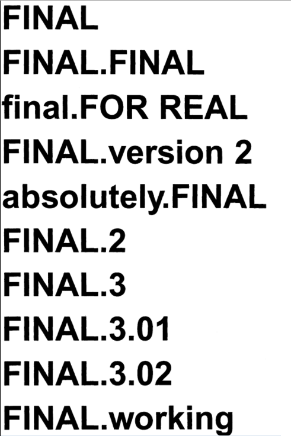

```{r setup, include=FALSE}
options(htmltools.dir.version = FALSE, servr.interval = 0.05)
knitr::opts_chunk$set(collapse = TRUE, fig.retina = 3)
library(xaringanExtra)
library(xaringan)
```

```{r share-again, echo=FALSE}
xaringanExtra::use_share_again()
```

class: title-slide, center, top
background-image: url(figs/landing2.png)
background-size: contain
background-position: bottom
background-size: 90%


#### `r rmarkdown::metadata$title`

#### `r rmarkdown::metadata$author`- @batool664

---

class: left, inverse

# A little bit about me!

- A computational biologist affiliated with the University of Liverpool.
- Founder of RLadies Chapter in Saudi Arabia (Dammam).
- A curator in the R Weekly team.
- Member of MiR accessibility committee.
- Member in the turing way community.
- Working on establishing an Open Science community in Saudi Arabia.

# Acknowledgment

- Anelda Van der
- Kirstie Whitaker, Malvika Sharan and Martina G. Vilas
- The Turing Way Community
- Alison Presmanes Hill (slides)

---

class: inverse, center, middle

# Why do we use ML in Biomedical Research?

---

background-image: url(figs/dna-to-protein2.jpg)
background-size: contain
background-position: 50% 1%
background-size: 80%
background-color: #ffffff

--

class: bottom
.pull-left[
### DNA
- DNA sequence alignment 
- DNA sequence classification
- DNA sequence clustering
- DNA pattern mining

Algorithms includes fuzzy sets, neural networks, genetic algorithms.]

--

.pull-right[

### RNA
- Mainly RNA-sequencing (RNA-seq)
- Differentially expressed genes (DEGs)
- Alternative splicing
- Small RNA expression

Algorithms include Logistic Regression, Random Forest, LMT, Random Subspace.]

.footnote[Image Credit: [ABC Science](https://astrobiochem.wordpress.com/grade-10-biology/chapter-10-dna-rna-and-protein-synthesis-3/)]
---

class: inverse, center, middle

# Solving the sequence is not enough!
We need to know the structure and function of the protein!

---

class: center, middle

background-image: url(figs/Sequence-to-function-relationship-A-Structure-function.png)
background-size: contain
background-position: 50% 20%
background-size: 80%
background-color: #ffffff

--

class: center, bottom
.bottom[
### How can we predict function from structure?
To predict the function from the structure, scientists use different approaches including machine learning (ML) and deep learning algorithms
.]
.left[
.footnote[Image Credit: [doi:10.1021/cr400525m](https://www.ncbi.nlm.nih.gov/pmc/articles/PMC4095912/)]]
---

class: center

background-image: url(figs/SARS-CoV-2-illo-scaled.jpeg)
background-size: contain
background-position: 50% 40%
background-size: 70%
background-color: #ffffff

--

class: left, bottom

.pull-bottom[
Prediction of protein structure is important to develop small molecules and targeted therapy for diseases. ]
.
.left[
.footnote[Credit: Supriyo Bhattacharya/Beckman Research Institute at City of Hope]]
---

class: inverse, center, middle
## Why not only rely on Experemtal Methods?

---

class: center, middle

background-image: url(figs/growthOfDatabases.png)
background-size: contain
background-position: 50% 10%
background-size: 50%
background-color: #ffffff

--

class: bottom

.bottom[ 
Because of the growing gap between the newly-sequenced and characterized sequences in the genome databases, computational methods in gene functional annotation are indispensable. Moreover, given the drop in the genome sequencing techniques' cost, this gap is only destined to grow.]
.
.left[
.footnote[Credit: Data for UniProtKB obtained form Claire O'Donovan via EBI database support]]
---

class: inverse, center, middle

## Biology has become a highly data-intensive science, dependent on complex, computational, and statistical methods!

---

class: inverse, center, middle

## So, how can we make these methods available and accessible for researchers, while ensuring that scientific results remain reproducible?

---

class: inverse, center, middle

## What is the percentage of reproducible research?

---

class: center, middle

background-image: url(figs/reproducibility-circle2.png)
background-size: 90%
background-color: #f3f3f3

.footnote[Credit:  Key results of the survey on reproducibility conducted by Nature in 2016]

---

class: inverse, center, middle

# How can we overcome the reproducibility crisis?

---

class: inverse, center, middle

# How can you improve the reproducibility of your data science project?

--

### OPEN SOURCE SOFTWARE

--

### SHARE CODE/ANALYSIS

--

### Share Computational ENVIRONMENT

--

### VERSION CONTROL

--

### TESTING

--

### DOCUMENTATION

--

### OPEN DATA/FAIR DATA

--

### OPEN ACCESS

---

class: inverse, center, middle

# This is called Open Science. 
## Open Science is about extending the principles of openness to the whole research cycle, fostering sharing and collaboration as early as possible thus entailing a systemic change to the way science and research is done

---

class: inverse, center, middle

# What are the FAIR principles?

---

class: center, bottom
background-image: url(figs/Fair-principles.jpg)
background-size: contain
background-size: 70%
background-color: #ffffff

class: left, bottom
.footnote[.red.bold[*] The Turing Way project illustration by Scriberia. Zenodo. http://doi.org/10.5281/zenodo.3332807]

---

class: inverse, center, middle

# Why do we use version control (git)?

---

#### Version Control in the Old Days ..

.pull-left[
]
.pull-right[

]

---

#### Real Version Control (including backup)


---

class: center, middle, inverse

## In the pandemic, some publishers have “opened” their journals to make certain articles freely available.

--

## Databases have been created that are completely open access, such as the Open COVID Pledge.

---

class: center, middle, inverse

## UNESCO is launching international consultations aimed at developing a Recommendation on Open Science for adoption by member states in 2021

--

## There is a network of Open Science Communities in Netherlands, Sweden, Germany, UK and others

---

class: center, left, inverse

## In line with vision 2030, we are starting an Open Science Community in Saudi Arabia.
## It's created and developed with the help of the "Open Life Sciences"


Open Life Sciences (OLS3) program helps individuals and stakeholders in research to become Open Science ambassadors.

---
class: center, left, inverse

We want to provide a place where newcomers and experienced peers interact, inspire each other to embed open science (research) practices and values in their workflows and provide feedback on policies, infrastructures and support services. Together working to make Open Science the norm. So we are calling out to researchers and colleagues in Saudi Arabia.  

.column[

Batool Almarzouq
The University of Liverpool
]
.column[

Founder and director of Talarify, Mentor OLS3
]
.column[

Paula Moraga, Assistant Professor in Statistics for Public Health
(KAUST)
]
.column[


----

Join me on the 24th of Feb for a workshop titled "Collaborating on Open Data Science Projects" as part of the Datathon for WiDS2021.
]

---

class: center, middle, inverse

## How did I start learning about reproducibility and Open Science?

---

class: center, top
#### How can you start your first step?

--

class: center
background-image: url(figs/welcome-turing-way.jpg)
background-size: contain
background-size: 60%
background-color: #ffffff

.left[.footnote[.red.bold[*] The Turing Way project illustration by Scriberia. Zenodo. http://doi.org/10.5281/zenodo.3332807]]

---

class: center, middle


---

class: center, middle, inverse
.pull-left[
## Kirstie Whitaker, Project Lead

]
.pull-right[
## Malvika Sharan, Community Manager

]

---

class: center, middle, inverse
# So, What is the turing way?

---
class: center, middle


---


---

background-color: #2b9686


---

background-color: black


---

class: center, middle, inverse
## Join the next book dash event!
### Book Dash November 2020


---

class: center, middle
## Review README.md Arabic translation


---

class: center, middle, inverse


---

class: center, middle, inverse
## Upcoming Workshop by the turing way
Register for the free workshop '[Boost your research reproducibility with Binder](https://www.software.ac.uk/news/spaces-available-turing-way-workshop-boost-your-research-reproducibility-binder)' run by Sarah Gibson from the Turing Way as part of our Research Software Camp on research accessibility.


---

class:  inverse

## Resources: 
- [The Turing Way](https://the-turing-way.netlify.app)

- [The CMU ML Blog](https://blog.ml.cmu.edu/2020/08/31/5-reproducibility/)

- [Redesign open science for Asia, Africa and Latin America](https://www.nature.com/articles/d41586-020-03052-3)

- [Open Science Beyond Open Access: For and with communities, A step towards the decolonization of knowledge
](https://zenodo.org/record/3946773#.YCzVmBMzY1I)

- [Embracing science as it is: beyond Nobel-like research](https://www.youtube.com/watch?v=YTwM10Qob5k)

- [Review on the Application of Machine Learning Algorithms in the Sequence Data Mining of DNA](https://www.frontiersin.org/articles/10.3389/fbioe.2020.01032/full)

---

class:  center, middle, inverse

# Thank you so much!

## batool@liverpool.ac.uk

## Twitter: @batool664

## Join RLadiesDammam: @RLadiesDammam
